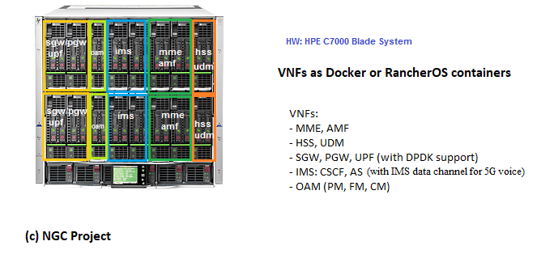

# New Generation Core (NGC) 

NGC is an experimental 4G/5G cloud native core network.

**Experimental work**

- Each Cloud Native Function (CNF) is based on the [Ligato](https://ligato.io/) framework
- User plane will be based on `VPP`

## Motivation
- [Open5gs](https://github.com/acetcom/open5gs).
- [Free5gc](https://github.com/free5gc/free5gc).
- [NextEPC](https://github.com/nextepc/nextepc).

## Hardware Configuration

### Contributions
Please feel free to contribute via a pull request or [Issues](https://github.com/eshikafe/ngc/issues)

Support required:
- Design specification for each CNF.
- Architectural design of the UPF.
- 5G CNF implementation in Go.
- Common services implementation in Go.

