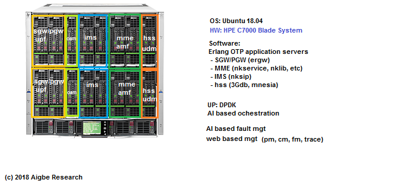

ngc
=====
EPC/5G cloud core network experiment

### Virtual Network Functions
- vMME + vAMF
- vSGW + vPGW + vUPF + vSMF
- vIMS (CSCF, AS)
- vHSS + vUDM
- OAM (CLI)

### Hardware Configuration

### Contributions
Please feel free to contribute via a pull request or [Issues](https://github.com/eshikafe/ngc/issues)

Support required:
- Documentation of design specifications for each VNF
- Design and implementation of a robust and scalable microservice architecture.
- VNF implementation in Golang or Erlang

